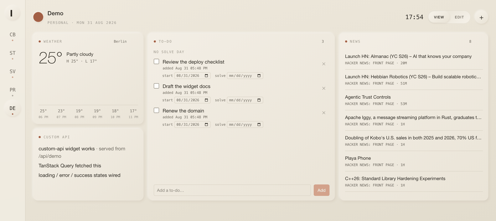

# cockpit

[](https://github.com/MarciD/Cockpit/actions/workflows/ci.yml)
[](https://github.com/MarciD/Cockpit/releases)
[](https://github.com/MarciD/Cockpit/pkgs/container/cockpit)
[](LICENSE)

A local-first personal dashboard. One page per "desk" — a job, a side project,
personal life — each a grid of configurable widgets, plus a Claude assistant that
answers over what's actually on screen.

Open merge requests with approval state. Assigned Jira issues. Today's calendar.
Weather, news, to-dos, recurring reminders. Everything on one page, refreshed in
the background, stored in a SQLite file you own.

> **cockpit has no user accounts.** It is meant to run on `127.0.0.1`. Anywhere
> else, set `COCKPIT_ACCESS_TOKEN` — a request that reaches it can read every
> connected integration. Read [SECURITY.md](SECURITY.md) before exposing it.



## Why

Every tool I use during the day has its own tab, its own notification style, and
its own idea of what's urgent. cockpit is the one page that answers "what needs
me right now" across all of them — without shipping my calendar and access tokens
to somebody else's server. No account, no sync, no telemetry: one Node process
and a SQLite file on a machine I control.

The design language is a warm, Braun-ish neumorphism ("Atelier") — soft cream
tiles, one accent hue per desk, Helvetica Neue and mono.

## Quick start

```sh
git clone git@github.com:MarciD/Cockpit.git cockpit
cd cockpit
cp env.example .env
$EDITOR .env                      # COCKPIT_SECRET is required
docker compose up -d --build
```

Open <http://127.0.0.1:3000>. The first screen creates a desk; then add widgets
and connect them. Migrations run on boot, so there is no setup step.

Or skip the build and take the published multi-arch image
(`linux/amd64` + `linux/arm64`, with build provenance):

```sh
docker run -d --name cockpit -p 127.0.0.1:3000:3000 \
  -e COCKPIT_SECRET="$(openssl rand -base64 32)" -e TZ=Europe/Berlin \
  -v cockpit-data:/data ghcr.io/marcid/cockpit:latest
```

Running it natively instead, or behind a reverse proxy, or as a macOS
LaunchAgent: [docs/self-hosting.md](docs/self-hosting.md).

## Widgets

| Widget                                           | Needs                                                        |
| ------------------------------------------------ | ------------------------------------------------------------ |
| **Merge Requests**                               | GitLab base URL + a read-only PAT (`read_api`)               |
| **Jira Issues**                                  | Jira site + email + API token                                |
| **Calendar**                                     | one or more "secret iCal address" URLs (Google, Outlook, …)  |
| **Assistant**                                    | an Anthropic API key                                         |
| **Language**                                     | an Anthropic API key — a full vocabulary trainer, not a tile |
| **Weather** · **News**                           | nothing (Open-Meteo, public RSS)                             |
| **To-do** · **Recurring Tasks** · **Custom API** | nothing                                                      |

Credentials are entered per widget, in that widget's own ⚙ settings — there is no
global keys page. They're stored server-side, encrypted, and read only inside
`/api/*` route handlers; they never reach the browser. Connections are shared by
provider, so the GitLab widget and the assistant's GitLab tools use one token.

When a provider rejects a stored token, the widget shows a **Reconnect** prompt
carrying the provider's own explanation — and keeps displaying the last good data
until you fix it. One failed refresh never blanks a tile.

## Adding a widget

A widget is one folder and one line in a registry. It declares its config schema
(which becomes its settings form), its data query, and a component:

```tsx
export default defineWidget({
  id: "world-clock",
  title: "Clock",
  category: "custom",
  configSchema: z.object({ timeZone: z.string(), label: z.string() }),
  defaultConfig: { timeZone: "UTC", label: "UTC" },
  layout: { defaultW: 3, defaultH: 4, minW: 2, minH: 3, mobileH: 3 },
  data: {
    queryKey: (config, profileId) => [
      "world-clock",
      profileId,
      config.timeZone,
    ],
    queryFn: async () => ({ iso: new Date().toISOString() }),
    refetchIntervalMs: 30_000,
  },
  Component: Panel,
  describe: (config) => `A clock showing ${config.label} time.`,
});
```

[docs/widgets.md](docs/widgets.md) is the full guide: the complete contract, what
the generated settings form supports, how to add a credentialed integration
end-to-end, and the styling rules.

## Architecture

Turborepo + pnpm. One app, five packages:

```
apps/web              Next.js 15 (App Router) — UI, /api routes, the scheduler
packages/widget-sdk   the defineWidget() contract + the signal bus
packages/widgets       the widget catalog, one folder each
packages/integrations  provider adapters + credential store + URL guard
packages/db            Drizzle schema, queries, migrations (better-sqlite3)
```

Widgets are client components that fetch only through `/api/*`. The credentials,
the database and the cache live on the far side of that line. A background
scheduler keeps the caches warm so a desk paints instantly, and the assistant
runs read-only tools over the same data.

[docs/architecture.md](docs/architecture.md) has the whole picture, including the
stale-while-revalidate cache, the signal bus, and how a widget that outgrows a
tile gets a layered domain slice of its own.

## Commands

|                                         |                                          |
| --------------------------------------- | ---------------------------------------- |
| `pnpm dev`                              | run the app (localhost:**4000**)         |
| `pnpm build`                            | production build                         |
| `pnpm check-types`                      | type-check every package                 |
| `pnpm format`                           | Prettier                                 |
| `pnpm --filter @cockpit/db db:generate` | create a migration after a schema change |
| `pnpm --filter @cockpit/db db:seed`     | optional demo desk with keyless widgets  |

Stack: Next.js 15 · React 19 · Chakra UI v3 · TanStack Query v5 ·
react-grid-layout · Drizzle + better-sqlite3 · croner · Anthropic SDK.

There is no test suite and no ESLint — deliberate, for a personal project.
Verification is `pnpm check-types`, `pnpm build`, and driving the app.

## Status

Built for one person's daily use, and shaped by that. It works, it's used every
day, and it has rough edges — the honest list lives in
[CLAUDE.md](CLAUDE.md#known-rough-edges--todo). Releases and what changed are in
[CHANGELOG.md](CHANGELOG.md). Issues and widget contributions are welcome; see
[CONTRIBUTING.md](CONTRIBUTING.md).

## License

[PolyForm Noncommercial 1.0.0](LICENSE) — **source available, not open source**.
Any noncommercial use is free: personal use, hobby projects, study, and
noncommercial organisations. Commercial use needs written permission — open an
issue. GitHub's licence detector doesn't recognise PolyForm, so the sidebar will
say "Other"; the terms are in [LICENSE](LICENSE).
