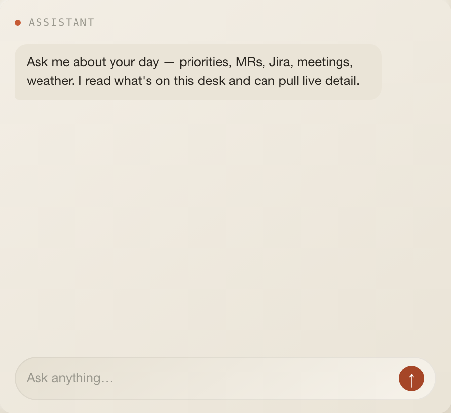
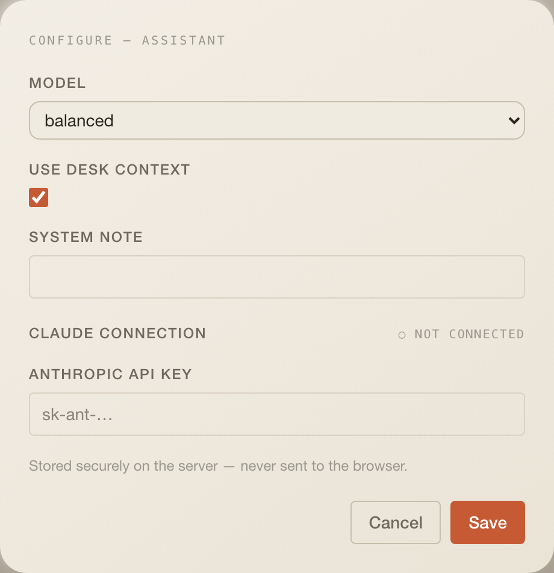

# Assistant

Ask Claude about your desk. The assistant reads the one-line summaries every
other widget on the desk publishes, can pull live detail through read-only
tools, and streams its answer into the tile.

## What it does

- A chat bubble UI with a seed greeting, `Clear`, an input (`Enter` sends) and
  an `↑` button. Replies stream in chunk by chunk.
- With **Use desk context** on, the current desk's `widget:context` signals
  (each widget's `describe()` sentence) are sent along as read-only data.
- Read-only tools the model may call: open merge requests, Jira issues,
  today's calendar events, weather (optional lat/lon/label, default Berlin),
  this desk's to-dos and recurring tasks, and a GitLab branch-merged check.

## Settings

| Setting          | Type                           | Default    | Notes                                                    |
| ---------------- | ------------------------------ | ---------- | -------------------------------------------------------- |
| `model`          | `fast` \| `balanced` \| `deep` | `balanced` | `claude-haiku-4-5`, `claude-sonnet-5`, `claude-opus-4-8` |
| `useDeskContext` | boolean                        | `true`     | Send the desk's widget summaries with every message      |
| `systemNote`     | string, optional               | empty      | Appended to the system prompt as "User preference: …"    |

**Connection** `anthropic` ("Claude"): one secret field, `apiKey`
(`sk-ant-…`). The same stored key serves every language-learning LLM route.
It must be an API key; programmatic use of a Claude subscription is not allowed.

## Data

| What   | How                                                                                                                                                            |
| ------ | -------------------------------------------------------------------------------------------------------------------------------------------------------------- |
| Query  | none; the widget only carries `profileId`. No refetch, no sync button.                                                                                         |
| Chat   | `POST /api/assistant { messages, profileId, context?, model, systemNote }` → `text/plain` stream                                                               |
| Server | Anthropic SDK Tool Runner, `max_tokens 2048`, up to 6 tool iterations, stable system prompt cached with `cache_control`, desk context framed as untrusted data |
| Errors | missing key → `400 { error: "needs-connect" }` and the tile shows the Connect prompt; other failures are appended to the reply as `[assistant error: …]`       |

## Assistant

This widget consumes the other widgets' `describe()` output; it publishes
nothing itself.

## Layout

4 × 8 by default, minimum 3 × 5, 11 rows on phones.

## Where the code lives today

- Tile: `index.tsx` (this folder).
- Route, tools and system prompt: `apps/web/app/api/assistant/route.ts`
  (260 lines).
- Tool data: `getGitlabData`, `getJiraData`, `getCalendarData`,
  `getWeatherData` in `apps/web/lib/integration-cache.ts`; `listTodos`,
  `listRecurringTasks` in `packages/db`.

Pending under the one-folder rule: the route and prompt move to `server/`;
tools are contributed by the widgets that own the data (`assistantTools`
exports collected from the server registry).

## Known limits

- Chat history is not persisted; `Clear` or a reload starts over.
- No rate limit or cost cap; the tier in settings decides the price.
- `profileId` is bound server-side and no tool accepts a URL, by design.
