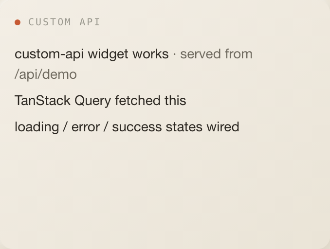
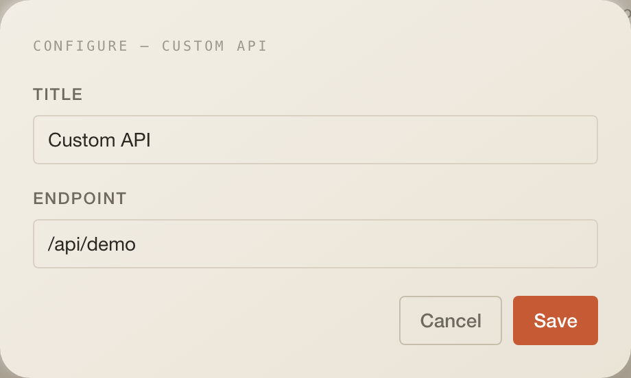

# Custom API

A config-only widget: point it at a JSON endpoint that returns
`{ items: [{ id, label, hint? }] }` and it lists the items. It exists to prove
the widget contract end to end (manifest, Zod config, data query, component,
loading / error / success states) and to wire up small personal endpoints
without writing a widget.

## Settings

| Setting    | Type   | Default      | Notes                                                                                                                     |
| ---------- | ------ | ------------ | ------------------------------------------------------------------------------------------------------------------------- |
| `title`    | string | `Custom API` | Stored in config; the tile header still shows the widget title                                                            |
| `endpoint` | string | `/api/demo`  | Fetched **from the browser**, so it must be reachable from where you sit. Same-origin paths need no CORS; other hosts do. |

## Data

| What     | How                                                                                                              |
| -------- | ---------------------------------------------------------------------------------------------------------------- |
| Reads    | `fetch(config.endpoint)` directly from the client; every 5 min, stale after 60 s, manual sync button on          |
| Response | `{ items: [{ id: string, label: string, hint?: string }] }`                                                      |
| Server   | none. `/api/demo` (`apps/web/app/api/demo/route.ts`) is a constant three-item sample used by the default config. |

## Assistant

No badge, no desk context.

## Layout

3 × 5 by default, minimum 3 × 3, 4 rows on phones.

## Where the code lives today

Everything is in `index.tsx` in this folder. Already in the one-folder shape.

## Known limits

- The endpoint is client-visible config, so never put a secret in the URL. An
  authenticated source belongs behind a `/api/*` route with a `connection`.
- No response validation: a payload that is not `{ items: [...] }` renders
  nothing or throws into the card's error state.
