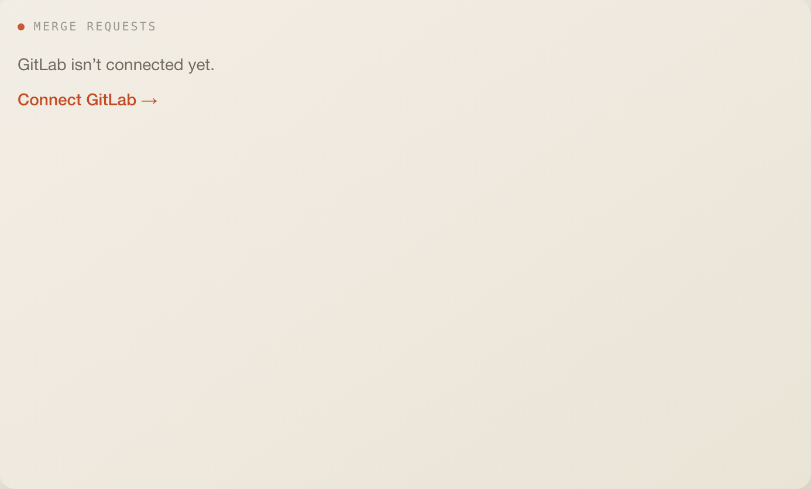
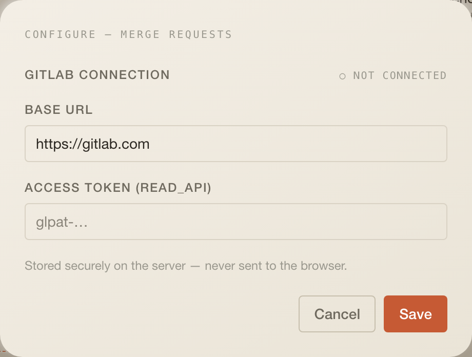

# Merge Requests

Your open GitLab merge requests and the ones waiting on your review, with
approval and review state that reflects how the team actually works.

## What it does

- Two tabs: **Assigned to me** (review requests) and **Mine** (authored).
- The assigned tab sorts requests into `Needs your attention`, `A colleague
has it` and `Settled`. Attention means: nobody has picked it up, you started
  but did not finish, or it was updated after your review (those float to the
  top). By team convention whoever reviews first does the re-review.
- Each row: a status mark (approved, approved by others, waiting, you
  commented, updated since your review, draft, unknown), the title linking to
  GitLab, `!iid · project`, up to two reviewer chips (`you approved · AB
reviewing +1`) and a comment count.

## Settings

No config fields. The settings modal holds the **GitLab connection**:
`baseUrl` (default `https://gitlab.com`, self-hosted instances allowed) and a
`token` with the `read_api` scope. The token is never echoed back; changing
the connection means re-entering both fields.

## Data

| What     | How                                                                                                                                                                                                          |
| -------- | ------------------------------------------------------------------------------------------------------------------------------------------------------------------------------------------------------------ |
| Reads    | `GET /api/w/gitlab-open-mrs`; every 5 min, stale after 60 s, manual sync forces a refetch                                                                                                                    |
| Response | `{ configured, items?: { mine: Mr[], assigned: Mr[] }, error?, authFailed? }`; each `Mr` carries `status`, `approvalsLeft`, `approvedBy`, `draft`, `comments`, `reviewers`, `myReview`, `updatedAfterReview` |
| Cache    | `throughCache("gitlab", …)`, key `integration:gitlab`, 5-minute TTL, stale data served on failure                                                                                                            |
| Provider | GitLab REST v4: MRs created by me, my user, MRs where I am reviewer, then per MR (first 15 of each list) approvals, and for review requests notes, last commit and reviewers                                 |
| Warm-up  | the scheduler refreshes at boot and every 5 min                                                                                                                                                              |

## Assistant

- Header badge: `2 TO REVIEW · 3 MINE`.
- Desk context: a sentence like `review requests: 1 awaiting first review, 2
updated since you reviewed; 3 authored (1 awaiting review).`
- Tools `get_open_mrs` and `check_branch_merged` use the same credential.

## Layout

6 × 8 by default, minimum 4 × 5, 11 rows on phones.

## Where the code lives

All of it is in this folder: `index.tsx` (tile), `config.ts` and `server/`
with the GitLab adapter, the route, the five-minute warm job and the two
assistant tools. The app only mounts it.

## Known limits

- One refresh can cost about 80 GitLab API calls.
- Approval state is a GitLab Premium/Ultimate feature; without it every MR
  shows `unknown`.
- GitLab under-reports reviewer engagement and reports `approvals_left: 0`
  vacuously on zero-approval projects, hence the notes-based `commented`
  signal and the `approved_by.length > 0` rule (`CLAUDE.md`).
