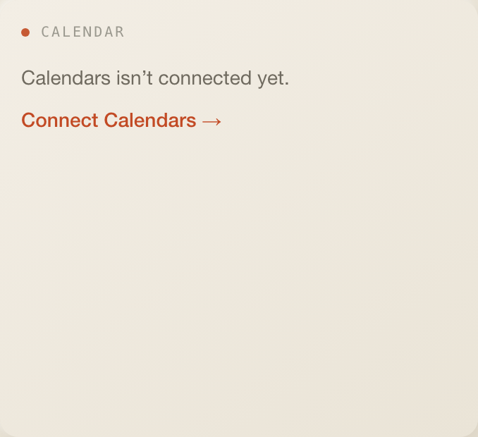
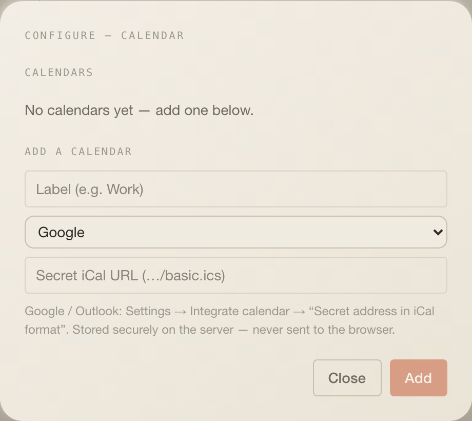

# Calendar

Your calendars, day, week or month, with join links for video meetings. Despite
the widget id, any iCal feed works: Google, Outlook or a plain `.ics` URL.

## What it does

- `Day | Week | Month` segmented control; the day view highlights the next
  event, week and month group events under date headers.
- Rows show the calendar's colour dot, `all day` or the start time, the title,
  and a `Join` link when a Meet, Zoom, Teams, Webex or Whereby link was found in
  the event.
- With more than one calendar, chips toggle calendars on and off (client-side).
- `⚙` opens the calendar list (see Settings).

## Settings

The widget replaces the generated form with its own `settings.tsx`: a list of
calendars (label, source, `Remove`) and an add form with label, source
(`google | outlook | ical`) and the **secret iCal URL**. The URL is the
credential: it is stored server-side under provider `calendar` and never sent
back to the browser. Google and Outlook expose it as "Secret address in iCal
format".

## Data

| What      | How                                                                                                                                                                   |
| --------- | --------------------------------------------------------------------------------------------------------------------------------------------------------------------- |
| Reads     | `GET /api/calendar?view=day&tz=<browser tz>`; every 10 min, stale after 5 min, manual sync forces a refetch. Week and month views run their own query with `view=week | month`. |
| Response  | `{ configured, calendars: [{ id, label, color, source }], items: [{ id, calendarId, title, start, end, allDay, videoUrl?, location? }], error? }`                     |
| Calendars | `GET/POST /api/calendar/calendars`, `PATCH/DELETE /api/calendar/calendars/[id]`; URLs pass `assertPublicHttpUrl`                                                      |
| Cache     | one `cachedFetch("calendar:<url>", …)` per calendar caching the raw ICS text for 10 min, in the `cache` table                                                         |
| Adapter   | `packages/integrations/src/google-calendar.ts`: `node-ical` 0.20, RRULE expansion with EXDATE and overrides, video-link detection                                     |
| Warm-up   | the scheduler fetches the day view at boot and every 5 min                                                                                                            |

## Assistant

- Header badge: today's event count.
- Desk context: `3 meetings today; next: Team sync at 09:30.` or `No meetings today.`
- Tool `get_today_events` uses the same data.

## Layout

3 × 6 by default, minimum 3 × 4, 7 rows on phones.

## Where the code lives today

- Tile and settings: `index.tsx`, `settings.tsx` (this folder).
- Routes: `apps/web/app/api/calendar/route.ts`,
  `apps/web/app/api/calendar/calendars/route.ts`,
  `apps/web/app/api/calendar/calendars/[id]/route.ts`.
- Cache helper: `getCalendarEvents` in `apps/web/lib/integration-cache.ts`.
- Calendar list storage: `listCalendars`, `addCalendar`, `updateCalendar`,
  `deleteCalendar` in `apps/web/lib/credentials.ts`.
- Adapter: `packages/integrations/src/google-calendar.ts`.

Pending under the one-folder rule: adapter, routes and the calendar list
helpers move into `server/`; the credential store itself stays shared.

## Known limits

- Timezone handling is best-effort (`CLAUDE.md`, known rough edge).
- A failing feed is not surfaced: the tile shows `No meetings today.` while
  `error` is set in the payload.
- Private-network feed URLs are refused unless `COCKPIT_ALLOW_PRIVATE_FETCH=1`.
