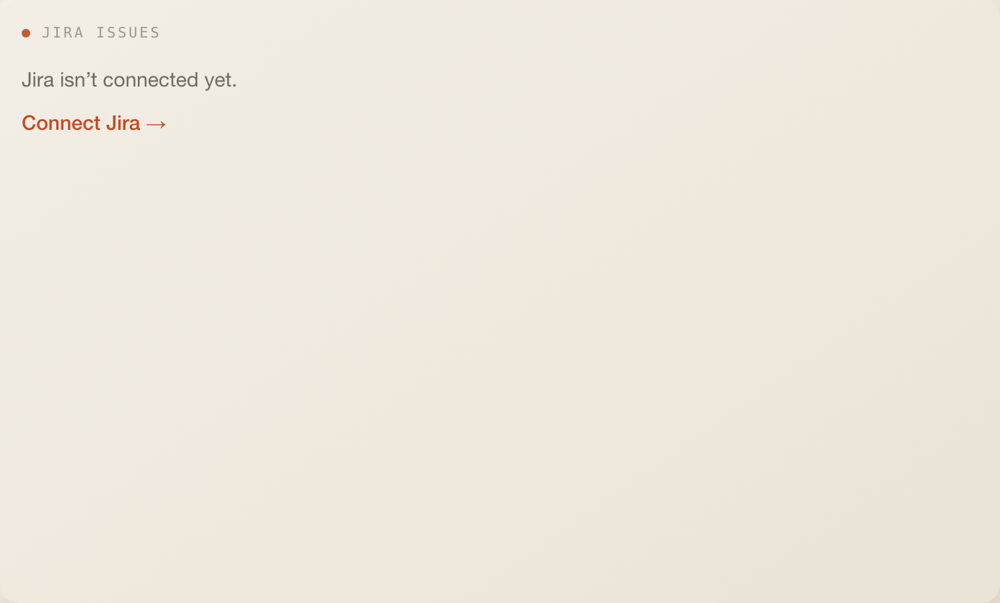
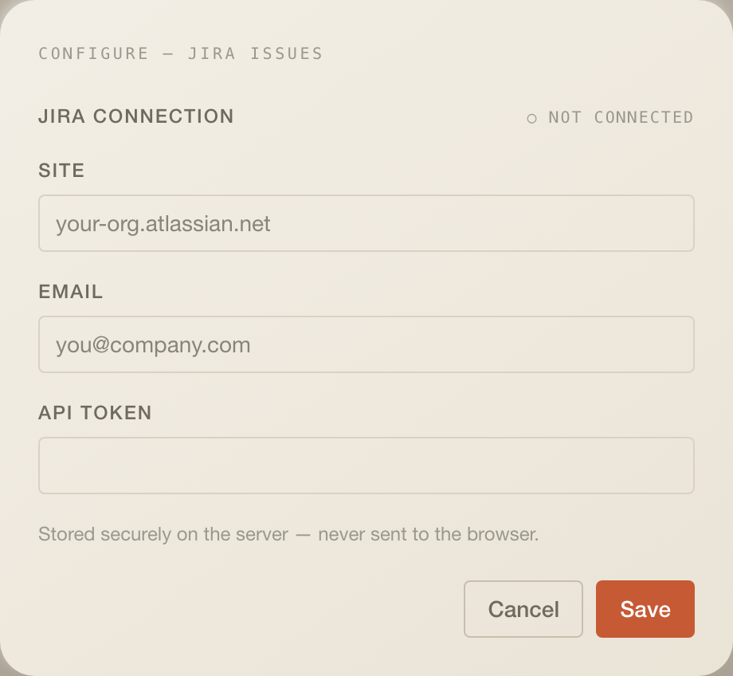

# Jira Issues

Issues assigned to you in Jira Cloud, most recently updated first, bucketed
by workflow stage.

## What it does

- A stacked bar and legend across four buckets read from the status name:
  `Code Review` (contains "review"), `In Progress` ("progress", "arbeit",
  "doing"), `Done` ("done", "deploy", "closed", "resolved", "fertig"), else
  `Other`.
- `Needs your attention` lists the first four issues that are not done: summary
  linking to Jira, key, status tag. A footer counts the done ones.

## Settings

No config fields. The settings modal holds the **Jira connection**: `site`
(`your-org.atlassian.net`), `email` and an API `token`. All three must be
entered together; the token is never echoed back.

## Data

| What     | How                                                                                                                                                                           |
| -------- | ----------------------------------------------------------------------------------------------------------------------------------------------------------------------------- |
| Reads    | `GET /api/w/jira-my-issues`; every 5 min, stale after 60 s, manual sync forces a refetch                                                                                      |
| Response | `{ configured, items?: [{ key, summary, status, url }], error?, authFailed? }`                                                                                                |
| Cache    | `throughCache("jira", …)`, key `integration:jira`, 5-minute TTL, stale data served on failure                                                                                 |
| Provider | `POST https://<site>/rest/api/3/search/jql` with Basic auth, JQL `assignee = currentUser() ORDER BY updated DESC`, 20 results; the site must be a bare host (regex-validated) |
| Warm-up  | the scheduler refreshes at boot and every 5 min                                                                                                                               |

## Assistant

- Header badge: `5 ASSIGNED`.
- Desk context: `5 Jira issues assigned, 3 need attention. Top: WDAW-1297 — …`
- Tool `get_jira_issues`.

## Layout

6 × 8 by default, minimum 4 × 5, 11 rows on phones.

## Where the code lives

All of it is in this folder: `index.tsx` (tile), `config.ts` and `server/`
with the Jira adapter, the route, the warm job and the assistant tool. The app
only mounts it.

## Known limits

- Jira Cloud only: bare host, forced https, email plus API token.
- At most 20 issues per refresh.
- The review and done tag colours are hardcoded rather than theme tokens.
