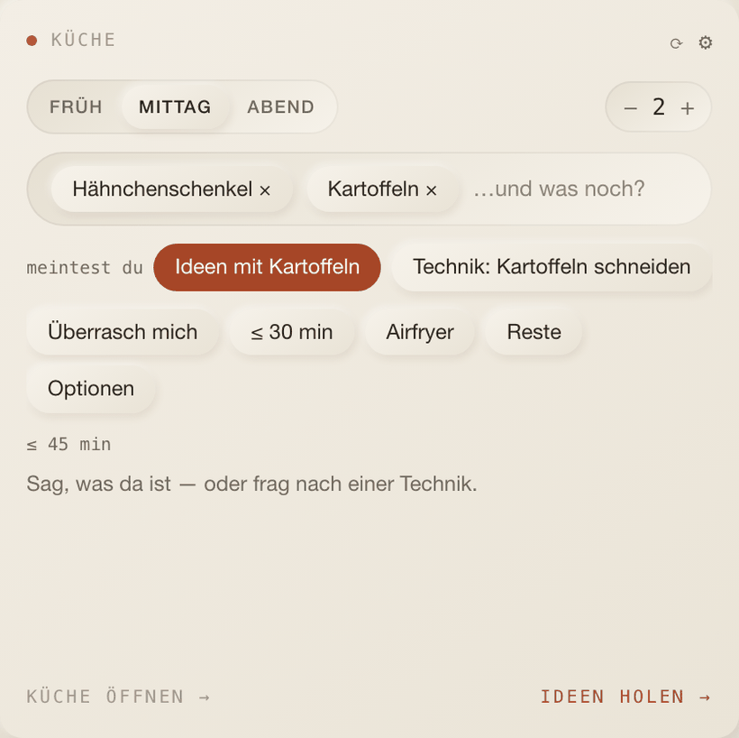
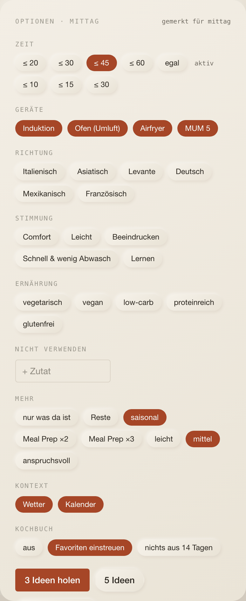
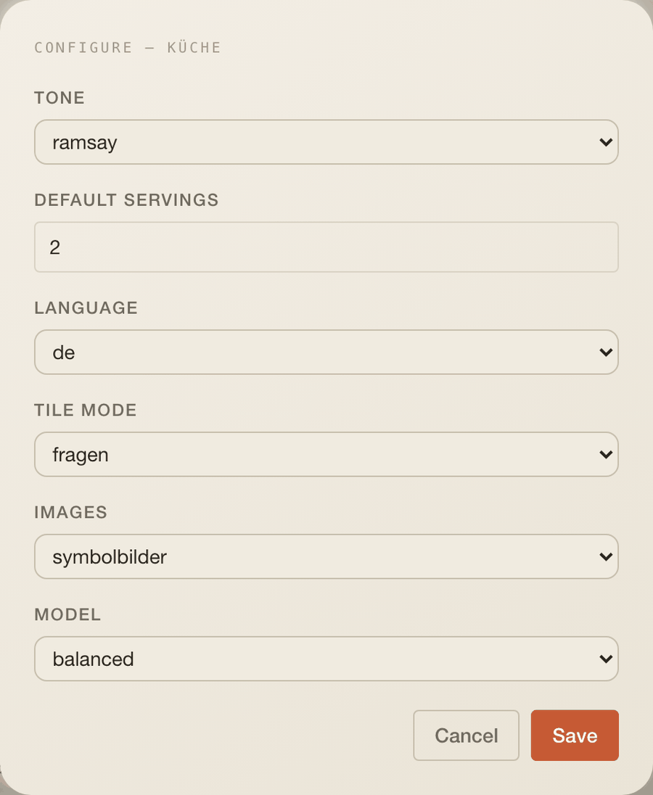

# Küche

Dein Küchenchef: Ideen, Rezepte und Techniken im Ramsay-Ton. The widget asks
three things (meal, people, what is there) and answers with three ideas; one
tap writes the full recipe in your format, and the same field also answers
"Avocado schneiden".

The content is German because the cooking is; the surrounding chrome stays
English like the rest of cockpit.

## What it does

- **Simple by default.** Meal slot is pre-selected from the clock, servings
  come from the Profil, and one line takes ingredients, a dish, or a
  technique. Four quick chips cover the usual asks; everything else is behind
  **Optionen** and is remembered per slot, so Tuesday evening opens the way
  you left it.
- **Ideas** arrive as three cards: a photo, the pitch in the Chef's voice, and
  time, difficulty and devices in mono. Tapping one writes the recipe.
- **Recipes** follow your six sections: Einordnung, Zutaten, Vorbereitung,
  numbered Zubereitung with device, temperature and timer badges,
  Chef-Kommentar, Variationen.
- **Techniques**: "Avocado schneiden" opens a card with tools, safety, steps
  with the sensory cue that tells you it worked, typical mistakes and a
  two-minute drill. A one-word query offers both readings rather than guessing.
- **Kochmodus** runs one step at a time with timers, keeps the screen awake,
  reads a step aloud, and ends in a two-tap rating that the next suggestion
  reads.

## The Chef

The persona is a system prompt in five stable blocks — role and tone, goals
and non-goals, the fixed kitchen (Induktion, Umluft, Ninja Double Stack,
Bosch MUM 5, with the consequences that follow), didactics, and the output
contract. Stable means cacheable: it is the first system block with a
one-hour `cache_control`, and everything that changes per request (profile,
weather, the clock, what you cooked last) follows it as data.

`tone` scales the insults, never the constructiveness: every jab ends in an
instruction, and that rule is part of the prompt.

## Settings

| Setting           | Type                                | Default        |
| ----------------- | ----------------------------------- | -------------- |
| `tone`            | `mild` \| `ramsay` \| `volle-kanne` | `ramsay`       |
| `defaultServings` | number                              | `2`            |
| `language`        | `de` \| `en`                        | `de`           |
| `tileMode`        | `fragen` \| `heute`                 | `fragen`       |
| `images`          | `aus` \| `symbolbilder` \| `eigene` | `symbolbilder` |
| `model`           | `fast` \| `balanced` \| `deep`      | `balanced`     |

Everything with a list — diet, allergies, dislikes, staples, equipment, time
budgets, and the evening nudge — lives in the **Profil** tab, because the
scheduler reads it server-side and the generated form has no list editor.

Credentials, all optional: `anthropic` (shared with the Assistant widget;
without it the widget explains what to connect), `pexels` for photos,
`youtube` for technique clips.

## Data

| What       | How                                                                                                                                                                   |
| ---------- | --------------------------------------------------------------------------------------------------------------------------------------------------------------------- |
| Tile       | `GET /api/w/kitchen-coach/profile?profileId=…`; stale after 60 s                                                                                                      |
| Ideas      | `POST …/ideas` with the whole option set                                                                                                                              |
| Recipes    | `POST …/recipes` (write), `…/recipes/scale`, `…/recipes/adapt`, `…/recipes/schedule`, `…/recipes/save`, `…/recipes/finish`; `GET …/recipes[/<id>]`, `PATCH`, `DELETE` |
| Techniques | `GET …/intent?q=`, `POST …/techniques`                                                                                                                                |
| Chat       | `POST …/coach` → a plain text stream                                                                                                                                  |
| Profil     | `GET …/profile`, `PUT …/profile`                                                                                                                                      |
| Tables     | `kitchen_recipes`, `kitchen_cook_log`, `kitchen_profiles`, `kitchen_techniques`                                                                                       |
| Job        | `kitchen-coach:dinner-nudge` every quarter hour; fires for each desk at its own nudge time                                                                            |

## Model calls

| Call      | Shape                                                                                                |
| --------- | ---------------------------------------------------------------------------------------------------- |
| Ideas     | Structured output (`output_config.format`), three to five ideas                                      |
| Recipe    | Structured output, the six-section document; steps carry device, temperature, duration and lead time |
| Adapt     | Structured output; the Chef is told to keep untouched parts verbatim                                 |
| Technique | Structured output, cached in `kitchen_techniques` by normalised query                                |
| Coach     | Streaming chat, optionally about the recipe on screen                                                |

Structured outputs are enforced by constrained decoding, so the JSON always
matches the schema. Every object still declares `additionalProperties: false`,
and the adapter normalises semantics anyway — a schema cannot promise sense.

Two things deliberately never reach the model: **scaling** (arithmetic in
`domain/scale.ts`, with salt and spices damped and rounded to quarters, so
doubling gives `1½ TL`, not `2 TL`) and the **seasonal calendar** (a table in
`domain/season.ts`).

## Notifications it raises

`kitchen.dinner` — the evening nudge, once a day per desk, at the time set in
the Profil. It is a reminder to decide, not a generated menu: ideas cost a
model call each and are better fetched when you tap.

`kitchen.prep` and `kitchen.timer` are registered for the schedule reminders
and the background timer fallback.

## Layout

4 × 8 by default, minimum 3 × 5, 9 rows on phones.

## Where the code lives

All of it is in this folder: `index.tsx` (tile), `config.ts`, `types.ts`,
`ui/`, `page/full-page.tsx`, and `server/` with the schema, the pure domain
(persona, scaling, backwards schedule, season, intent), the services, the
Anthropic, Pexels, YouTube and Drizzle adapters, `routes.ts` and `jobs`.

## Known limits

- Photos are stock: the card says "Symbolbild", and Pexels asks for the credit
  the recipe footer carries. Your own photos are the next step.
- The weather and calendar context is read from the cache the weather and
  calendar widgets fill; with neither on the desk, those lines are simply
  absent.
- Chat history is not persisted.
