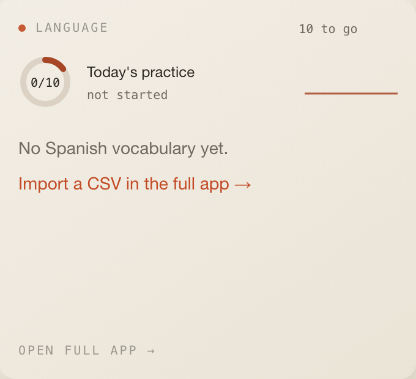
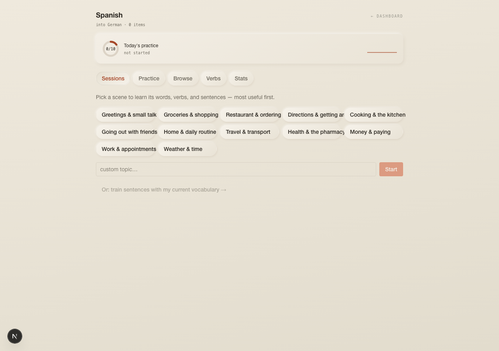
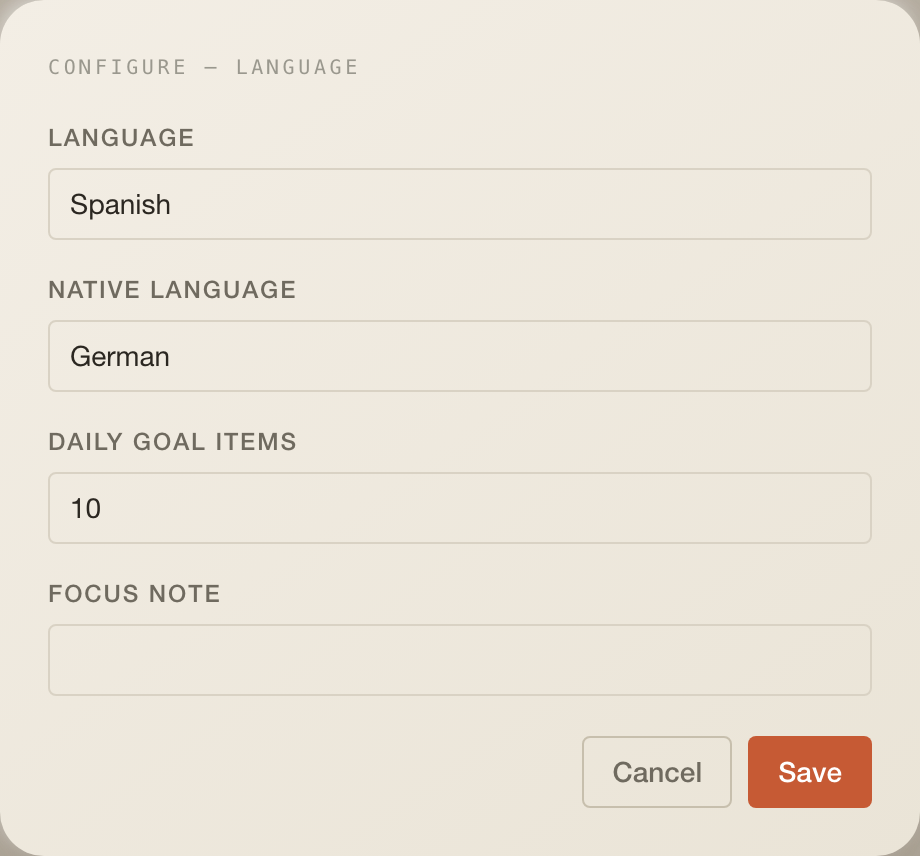

# Language

Vocabulary practice for a language you set, with a full app behind the tile.
Set `Spanish` in the settings and the instance becomes a Spanish trainer; add a
second instance for another language. Data is scoped by desk and language.
This widget is also the reference for a domain-rich widget; the layering is
explained in [ARCHITECTURE.md](ARCHITECTURE.md).

## What it does

- **Tile:** today's score strip (ring, accuracy, streak, seven-day sparkline)
  and one exercise at a time: flashcard, multiple choice or cloze, with an
  offline hint, a Claude hint on request, and browser speech for the target
  language. `Open full app →` leads to the page.
- **Full app** at `/learn/<language>?profile=<desk>&native=<language>`
  with five tabs: `Sessions` (topic-based lessons planned by Claude, resumable
  after a reload), `Practice` (batches of eight, plus Claude-graded sentence
  writing), `Browse` (add, edit, delete items), `Verbs` (guided conjugation
  lessons, tables cached), `Stats` (totals, CSV import and export).

## Settings

| Setting          | Type   | Default  | Notes                                                        |
| ---------------- | ------ | -------- | ------------------------------------------------------------ |
| `language`       | string | empty    | Free text, case-sensitive; data is keyed by this exact value |
| `nativeLanguage` | string | `German` | Translation side and grading language                        |
| `dailyGoalItems` | number | `10`     | Items per day for the goal ring and the streak               |
| `focusNote`      | string | empty    | Passed to Claude when planning sessions and lessons          |

No connection of its own: LLM features use the Anthropic key stored by the
Assistant widget. Without it, hints, sessions, grading and verb lessons show a
"connect an Anthropic key" note; flashcards, multiple choice and cloze work
offline.

## Data

| What   | How                                                                                                                                                                                                                 |
| ------ | ------------------------------------------------------------------------------------------------------------------------------------------------------------------------------------------------------------------- |
| Tile   | `GET /api/learn/score?…&today=&goal=` and `GET /api/learn/items?…` in parallel; stale after 15 s; sync button on; then `GET /api/learn/next?count=1&mode=general`, `POST /api/learn/hint`, `POST /api/learn/answer` |
| App    | 17 routes under `apps/web/app/api/learn/*`: items, next, score, answer, hint, grade, generate, conjugate, import, export, `session/{topics,topic,sentences}`, `verb/lesson`                                         |
| Tables | `vocab_items`, `learning_score`, `learning_sessions`, `conjugations`                                                                                                                                                |
| LLM    | `structuredCall` (forced tool use) with tiers: hints and grading `fast`, item generation and topic planning `balanced`                                                                                              |
| CSV    | columns `category,<language>,<native>,notes`; `,` or `;` delimited; duplicates skipped so progress is never wiped                                                                                                   |

## Assistant

- Header badge: `4 to go` or `done`.
- Desk context: `Spanish: 6/10 items today, 3-day streak.` or
  `Spanish: no vocabulary imported yet.`

## Layout

3 × 6 by default, minimum 3 × 4, 5 rows on phones.

## Where the code lives today

- Tile, UI and page: this folder (`index.tsx`, `ui/`, `page/full-page.tsx`,
  exported on the `@cockpit/widgets/language-learning/page` subpath).
- Page route: `apps/web/app/learn/[language]/page.tsx`.
- Domain slice: `apps/web/lib/language-learning/{domain,application,infrastructure,composition.ts}`.
- Routes: `apps/web/app/api/learn/**` (17 files).

Pending under the one-folder rule: the slice becomes `server/`, the 17 route
files one `server/routes.ts`, and this README absorbs `ARCHITECTURE.md`.

## Known limits

- `structuredCall` output is not schema-validated; every adapter normalises
  the model's JSON before use (`CLAUDE.md`).
- Session resume is per browser (`localStorage`).
- Pronunciation depends on the voices your browser ships.
- CSV export does not escape spreadsheet formula prefixes (`SECURITY.md`).
