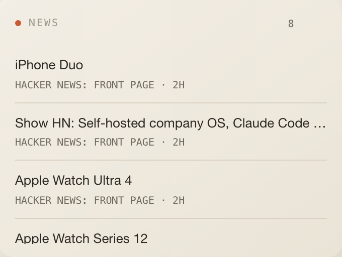
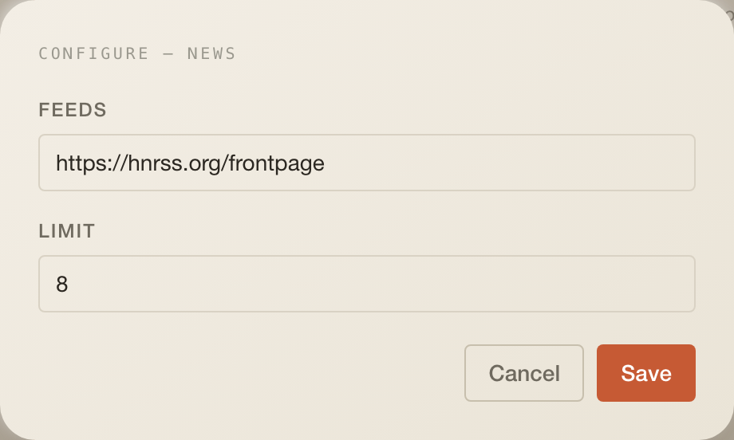

# News

Headlines from your RSS and Atom feeds, newest first, merged across feeds.

## What it does

- One row per headline: the title links to the article, the meta line shows
  the feed name and a relative age (`12M`, `3H`, `2D`).
- Several feeds are merged and sorted by publication time, then cut to the
  limit.

## Settings

| Setting | Type   | Default                       | Notes                                                                                                               |
| ------- | ------ | ----------------------------- | ------------------------------------------------------------------------------------------------------------------- |
| `feeds` | string | `https://hnrss.org/frontpage` | Comma- or newline-separated URLs; the widget splits the string itself because the generated form has no list editor |
| `limit` | number | `8`                           | Server caps it at 30                                                                                                |

## Data

| What     | How                                                                                                                            |
| -------- | ------------------------------------------------------------------------------------------------------------------------------ |
| Reads    | `GET /api/w/news?feed=…&feed=…&limit=`; every 10 min, stale after 5 min, manual sync forces a refetch                          |
| Response | `{ configured, items?: [{ id, title, link, source, publishedAt }], error? }`                                                   |
| Cache    | `cachedFetch("news:<sorted feeds>:<limit>", …)` with a 10-minute TTL in the `cache` table                                      |
| Provider | each feed is fetched server-side after `assertPublicHttpUrl`, capped at 2 MB, parsed with `fast-xml-parser` (RSS 2.0 and Atom) |

## Assistant

- Header badge: the number of headlines.
- No desk context.

## Layout

3 × 5 by default, minimum 3 × 3, 6 rows on phones.

## Where the code lives

All of it is in this folder: `index.tsx` (tile), `config.ts`, `types.ts` and
`server/` with the feed adapter and the route. The app only mounts it.

## Known limits

- A feed that fails is dropped silently; if every feed fails the tile says
  `No headlines.` without an error.
- Private-network and loopback feed URLs are refused unless
  `COCKPIT_ALLOW_PRIVATE_FETCH=1` (`SECURITY.md`).
