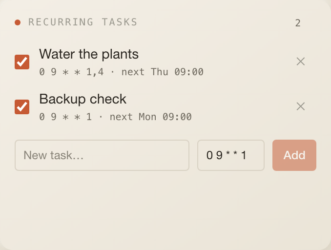

# Recurring Tasks

Cron-scheduled reminders for this desk. Each task is a title plus a cron
expression; the server's scheduler keeps one croner job per enabled task and
shows you when it fires next.

## What it does

- Rows show an enable/disable checkbox, the title (faint when disabled), the
  cron expression and `next Wed 09:00`.
- The add row takes a title and a cron expression (default `0 9 * * 1`).
- When a task fires, the scheduler advances its `next run` and raises a
  `tasks.due` notification (severity `action`) that deep-links to the desk. It
  shows up in the bell, toasts in an open tab, and reaches the phone once the
  phase-1 channels exist.

## Settings

None.

## Data

| What   | How                                                                                                                                                                                       |
| ------ | ----------------------------------------------------------------------------------------------------------------------------------------------------------------------------------------- |
| Reads  | `GET /api/tasks?profileId=…`; no interval, stale after 30 s                                                                                                                               |
| Writes | `POST /api/tasks { profileId, title, cron }` · `PATCH /api/tasks/[id] { enabled, title, cron }` · `DELETE /api/tasks/[id]`                                                                |
| Table  | `recurring_tasks` (`id, profile_id, title, cron, next_run_at, enabled`)                                                                                                                   |
| Jobs   | `reloadRecurringTasks()` in `apps/web/lib/scheduler.ts` re-registers every enabled task as `new Cron(cron, { name: "task:<id>", protect: true, catch: onJobError }, …)` after each change |

## Notifications it raises

`tasks.due` — one per firing, titled with the task, body `Recurring task ·
<cron>`, linking to `/<desk>`. Produced in `apps/web/lib/scheduler.ts`.

## Assistant

- Header badge: number of tasks.
- Desk context: `2 active recurring tasks (of 3).`
- Tools `get_recurring_tasks` and, for what has fired, `get_notifications`.

## Layout

3 × 5 by default, minimum 3 × 3, 7 rows on phones.

## Where the code lives today

- Tile: `index.tsx` (this folder).
- Routes: `apps/web/app/api/tasks/route.ts`,
  `apps/web/app/api/tasks/[id]/route.ts`.
- Scheduler: `reloadRecurringTasks` in `apps/web/lib/scheduler.ts`.
- Queries: `listRecurringTasks`, `listEnabledRecurringTasks`,
  `createRecurringTask`, `updateRecurringTask`, `deleteRecurringTask`.

Pending under the one-folder rule: routes become `server/routes.ts`, the
per-task job registration becomes `server/jobs.ts`, and the scheduler keeps
only the generic hook.

## Known limits

- The API accepts any cron string; an invalid one is silently skipped by the
  scheduler and keeps its previous `next run`.
- A task that fires while the server is down is not caught up on restart.
- Cron runs in the server's `TZ` (Europe/Berlin on the launchd install).
- One server process only: there is no cross-process lock.
