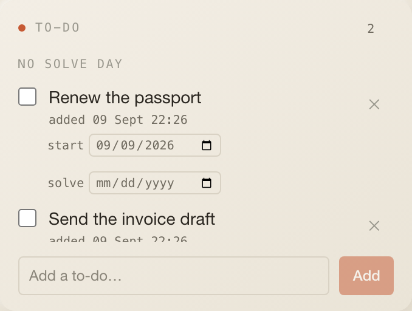

# To-do

A simple local checklist for this desk. To-dos live in cockpit's own SQLite
database, grouped by the day you want them solved, so the list doubles as a
lightweight day planner.

## What it does

- Open to-dos are grouped by their _solve_ day (`Today`, `Tomorrow`, a weekday
  and date, or `No solve day`), oldest group first.
- Each row: a done checkbox, a click-to-edit title (Enter commits, Escape
  cancels), an `added …` / `done …` timestamp, a delete `✕`, and two native date
  inputs for the start and the solve day (each constrains the other).
- `Show completed (n)` reveals finished items, newest first.
- Adding a to-do stamps its start day with today; marking it done stamps
  `completedAt` and, if no solve day was set, the solve day with today.

## Settings

None. The settings modal only offers Cancel / Save.

## Data

| What   | How                                                                                                                             |
| ------ | ------------------------------------------------------------------------------------------------------------------------------- |
| Reads  | `GET /api/todos?profileId=…`; no interval, stale after 30 s, refetched after every change                                       |
| Writes | `POST /api/todos { profileId, title }` · `PATCH /api/todos/[id] { done, title, startDate, endDate }` · `DELETE /api/todos/[id]` |
| Table  | `todos` in `packages/db/src/schema.ts` (`id, profile_id, title, done, order, start_date, end_date, created_at, completed_at`)   |
| Sync   | no manual sync button (no server cache to force)                                                                                |

## Assistant

- Header badge: the number of open to-dos.
- Desk context: `3 open to-dos: Book the dentist; Renew the passport; …` or
  `All to-dos done.`
- Tool `get_todos` reads the same table for the bound desk. The system prompt
  frames to-dos as the user's intentions, not verified facts.

## Layout

3 × 5 by default, minimum 3 × 3, 7 rows on phones.

## Where the code lives today

- Tile: `index.tsx` (this folder).
- Routes: `apps/web/app/api/todos/route.ts`,
  `apps/web/app/api/todos/[id]/route.ts`.
- Queries: `listTodos`, `createTodo`, `setTodo`, `deleteTodo` in
  `packages/db/src/queries.ts`.

Pending under the one-folder rule (`docs/widgets.md#where-a-widget-lives`):
the two route files become `server/routes.ts`. The table stays in the core
schema because desks own it.

## Known limits

- Any `profileId` is accepted by the API; there is no per-desk authorisation
  (single-user app, see `SECURITY.md`).
- The `order` column exists but there is no reordering UI.
- Start and solve days are what the `/timetracking` skill reads.
