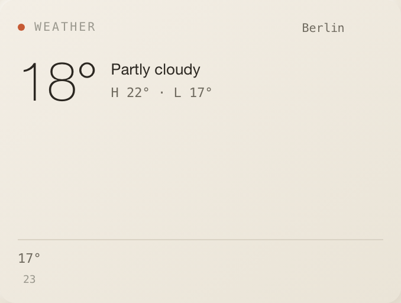
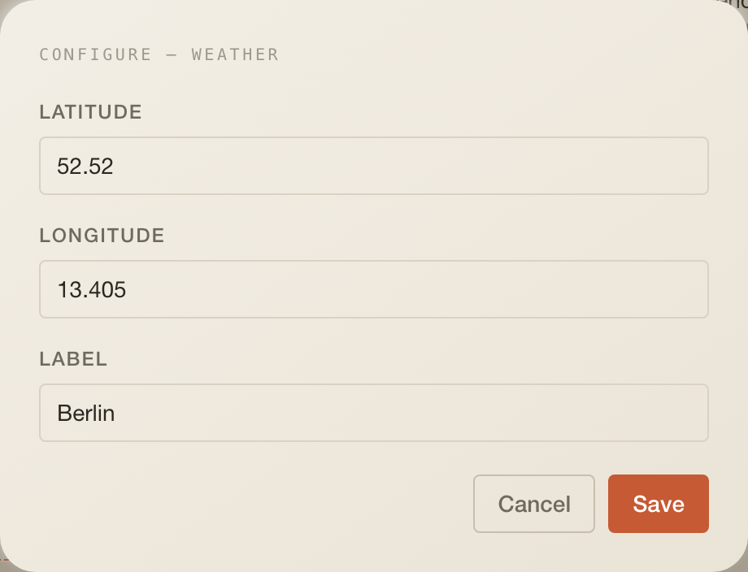

# Weather

Current conditions and today's hourly forecast for one place, from Open-Meteo.
Keyless, so it works on a fresh install without any connection.

## What it does

- A large current temperature, the condition (from the WMO weather code), the
  day's high and low, and an hourly strip of up to six temperatures starting at
  the current hour.
- One instance per place; add another instance for another city.

## Settings

| Setting     | Type   | Default  | Notes                                          |
| ----------- | ------ | -------- | ---------------------------------------------- |
| `latitude`  | number | `52.52`  | Decimal degrees                                |
| `longitude` | number | `13.405` | Decimal degrees                                |
| `label`     | string | `Berlin` | Shown in the header badge and to the assistant |

## Data

| What     | How                                                                                                                                                                                      |
| -------- | ---------------------------------------------------------------------------------------------------------------------------------------------------------------------------------------- |
| Reads    | `GET /api/w/weather?lat=&lon=&label=`; every 30 min, stale after 10 min, manual sync forces a refetch                                                                                    |
| Response | `{ configured, items?: { label, tempC, code, condition, highC, lowC, hourly: [{ time, tempC }] }, error? }`                                                                              |
| Cache    | `cachedFetch("weather:<lat>,<lon>", …)` with a 30-minute TTL in the `cache` table                                                                                                        |
| Provider | `https://api.open-meteo.com/v1/forecast` (current temperature and weather code, daily max/min, hourly temperature, `timezone=auto`, one day); no key, fixed host, no client-supplied URL |

## Assistant

- Header badge: the label.
- Desk context: `Weather in Berlin: 18°, Partly cloudy (H 22° / L 17°).`
- Tool `get_weather` reuses the same helper and defaults to Berlin.

## Layout

3 × 5 by default, minimum 3 × 3, 5 rows on phones.

## Where the code lives

All of it is in this folder: `index.tsx` (tile), `config.ts`, `types.ts` and
`server/` with the Open-Meteo adapter, the route and the assistant tool. The
app only mounts it.

## Known limits

- The cache key ignores the label, so two instances with identical coordinates
  share one payload and show the first label until the TTL expires.
- An error that arrives together with cached data is not shown; the cached
  reading stays on screen.
