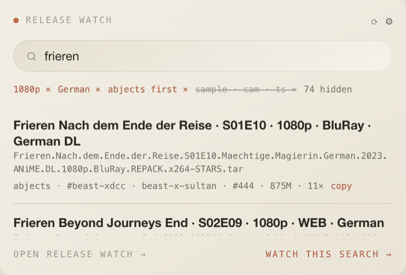
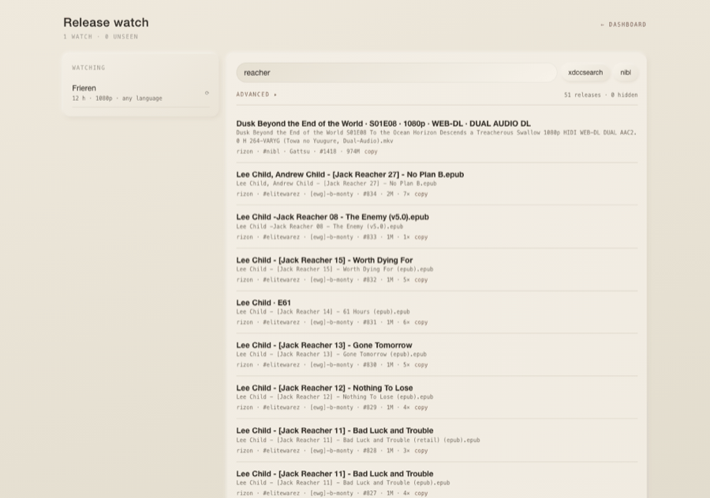
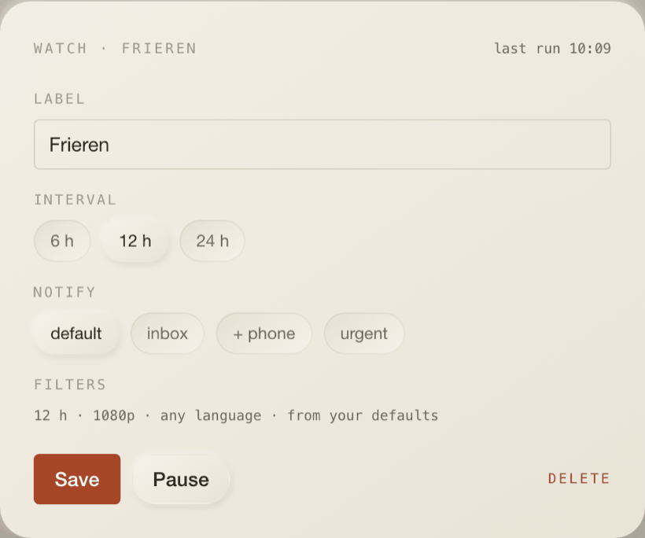
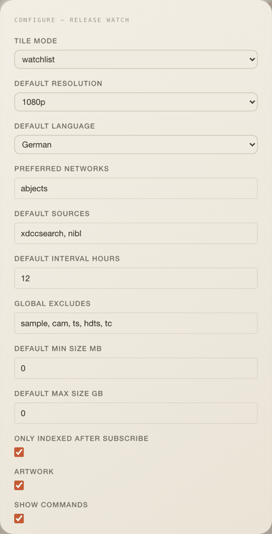

# Release watch

Search the public XDCC indexes, save a search as a watch, and get told when
something new turns up. The widget **searches and notifies**; it never connects
to IRC and transfers nothing. The copy button hands you the
`/msg <bot> xdcc send #<n>` line the index already shows.

## What it does

- **Simple by default.** Your defaults live in the widget settings and apply to
  every search and every new watch: resolution, language, preferred network,
  sources, excludes, size bounds. They show as chips under the search field, and
  one tap lifts a default for this search only. The screenshot above shows
  `1080p × German × abjects first ×` with the standing excludes struck through
  and `74 hidden` for what they removed.
- **Results are grouped by release**, not by bot. One line per file with the
  parsed title in prose, the raw filename in mono, and one row per offer
  (network, channel, bot, pack, size, gets) with a copy button.
- **A watch is a search plus a schedule.** "Watch this search" snapshots the
  query and the filters; the scheduler re-runs it and raises one notification
  per run.

## Full page

`/w/xdcc-watch?profile=<desk>` — the watch list on the left, search and results
on the right, plus what the watches have found since you last looked.

The watch editor opens simple (label, query, interval, notify, and a line
saying which filters it inherited) with the rest behind "advanced".

## Settings

Everything here is a **default**, not a per-search choice. Changing one never
rewrites an existing watch, which snapshotted its filters when it was created.

| Setting                                 | Type                                     | Default                     |
| --------------------------------------- | ---------------------------------------- | --------------------------- |
| `tileMode`                              | `watchlist` \| `search`                  | `watchlist`                 |
| `defaultResolution`                     | `any` \| `720p` \| `1080p` \| `2160p`    | `1080p`                     |
| `defaultLanguage`                       | `any` \| `German` \| `English` \| `dual` | `German`                    |
| `preferredNetworks`                     | comma list, ordered                      | `abjects`                   |
| `defaultSources`                        | comma list                               | `xdccsearch, nibl`          |
| `defaultIntervalHours`                  | number                                   | `12`                        |
| `globalExcludes`                        | comma list                               | `sample, cam, ts, hdts, tc` |
| `defaultMinSizeMb` · `defaultMaxSizeGb` | numbers, `0` = off                       | `0` · `0`                   |
| `onlyIndexedAfterSubscribe`             | boolean                                  | `on`                        |
| `artwork` · `showCommands`              | booleans                                 | `on` · `on`                 |
| `resultsPerSource`                      | number, ≤ 50                             | `50`                        |

Posters are optional: AniList needs no key, TMDB uses a `tmdb` credential
(`{ apiKey }`) if one is stored. Without either you get rows without artwork.

## Sources

| Source           | What it gives                                                                                             |
| ---------------- | --------------------------------------------------------------------------------------------------------- |
| `xdccsearch.com` | JSON, first-indexed and last-seen timestamps, five networks including Abjects. One page of ≤ 50 per poll. |
| `nibl.co.uk`     | JSON, anime on Rizon; `lastModified` behaves as first-seen of a (bot, pack, name, size) tuple.            |

SunXDCC was deleted in April 2026 and ixIRC is a parked domain; its successor
skullxdcc forbids automation (robots plus proof-of-work), so neither is used.
Requests carry a real User-Agent, take one page per poll, and go through the
shared cache (ten minutes per source and query), so a failing source serves its
last good answer instead of emptying the tile.

## Identity and what counts as new

Pack numbers get renumbered and the same file sits on several bots, so identity
is the **normalised filename** (lowercased, extension and `[HASH]` stripped,
separators collapsed). In series mode the identity is the parsed season and
episode instead, so one episode notifies once however many files carry it.

A watch's first run **seeds silently**: everything already out there is recorded
as seen, so day one is quiet. After that, `indexed-after` (the default) only
counts packs the source first saw after the watch existed, with a day of grace;
`unseen` counts anything not in the seen set.

## Data

| What     | How                                                                                                      |
| -------- | -------------------------------------------------------------------------------------------------------- |
| Tile     | `GET /api/w/xdcc-watch/watches?profileId=…`; every 5 min, stale after 60 s, manual sync                  |
| Search   | `GET /api/w/xdcc-watch/search?q=&filter=&sources=&networks=&limit=&artwork=`                             |
| Watches  | `GET/POST /api/w/xdcc-watch/watches`, `PATCH/DELETE …/watches/<id>`, `POST …/run/<id>`                   |
| Releases | `GET /api/w/xdcc-watch/releases?profileId=…[&watchId=]`, `POST …/releases/seen`                          |
| Tables   | `xdcc_watches`, `xdcc_seen` (this folder's `server/schema.ts`)                                           |
| Job      | `xdcc-watch:watch` every 30 min runs every watch whose interval has elapsed, with jitter between watches |

## Notifications it raises

`xdcc.release` — by default one digest per run ("3 new · Frieren", the first
three headlines, and the first offer's command when `commandInBody` is on),
linking to the full page filtered to that watch. A watch can override the
channels (`inbox`, `+ phone`, `urgent`) and turn the digest off for one
notification per release, capped at five.

## Layout

4 × 6 by default, minimum 3 × 4, 6 rows on phones.

## Where the code lives

All of it is in this folder, per the one-folder rule
(`docs/widgets.md#where-a-widget-lives`): `index.tsx` (tile), `config.ts`,
`types.ts`, `ui/`, `page/`, and `server/` with the schema, the pure domain
(release grouping, the filter model, watch rules), the services, the indexer,
artwork and Drizzle adapters, `routes.ts` and `jobs.ts`. The app only mounts it:
`/api/w/[widget]` dispatches the routes, `/w/[widget]` renders the page, and the
scheduler registers the job.

## Politeness and scope

Indexers list what bots announce publicly. This widget queries them the way a
person would, once every twelve hours per watch by default, one page at a time,
and it stops at telling you. Downloading is out of scope and out of the code.
