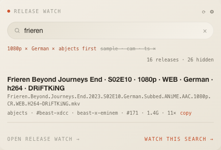
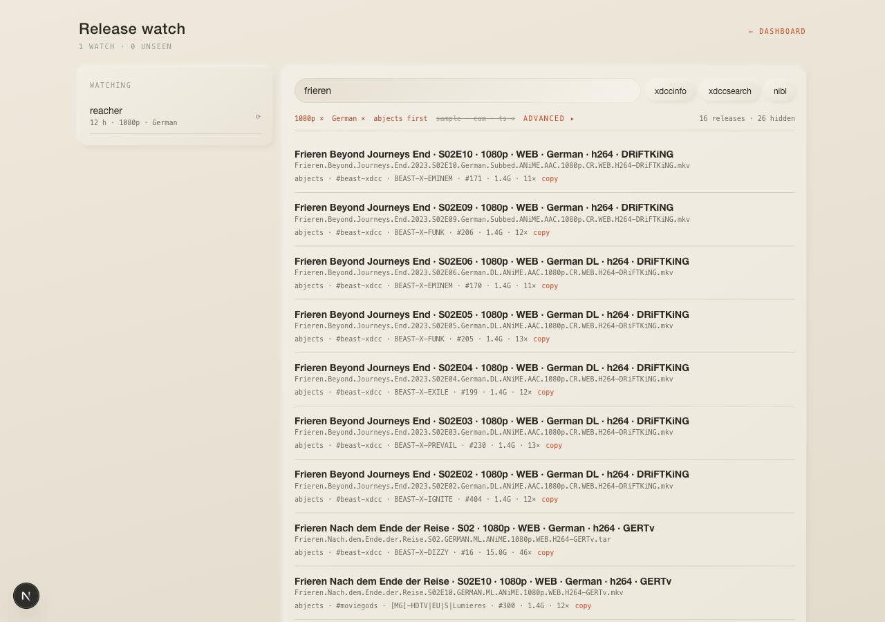
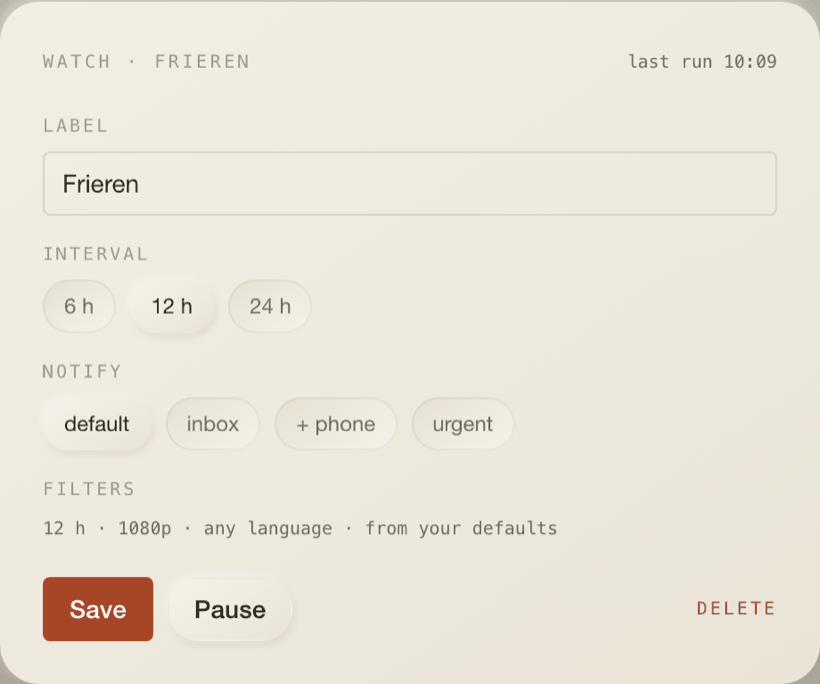
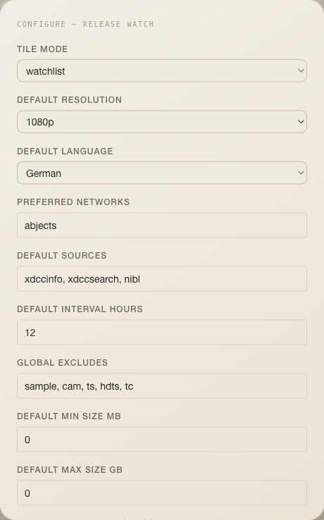

# Release watch

Search the public XDCC indexes, save a search as a watch, and get told when
something new turns up. The widget **searches and notifies**; it never connects
to IRC and transfers nothing. The copy button hands you the
`/msg <bot> xdcc send #<n>` line the index already shows.

## What it does

- **Simple by default.** Your defaults live in the widget settings and apply to
  every search and every new watch: resolution, language, preferred network,
  sources, excludes, size bounds. They show as chips under the search field, and
  one tap lifts a default for this search only. The screenshot above shows
  `1080p × German ×`, `abjects first` (an order, not a filter, so nothing to
  lift), the standing excludes struck through, and how many releases they hid.
- **Results are grouped by release**, not by bot. One line per file with the
  parsed title in prose, the raw filename in mono, and the best offer
  (network, channel, bot, pack, size, gets) with a copy button; the other
  bots sit behind "+N more bots". The count line says how many releases the
  defaults hid, the tile shows the first eight and links the rest to the
  page with the query carried over, and a source that failed says so.
- **A watch is a search plus a schedule.** "Watch this search" snapshots the
  query and the filters; the scheduler re-runs it and raises one notification
  per run.

## Full page

`/w/xdcc-watch?profile=<desk>[&q=<search>]` — the watch list on the left,
search and results on the right, plus what the watches have found since you
last looked. The page reads the desk's defaults (`GET defaults`) and shows
them as chips before the first search, so a search from the tile and one from
the page mean the same thing; "reset" returns a tweaked filter to them. Under
the results, one meta line per source: `xdcc.info 200 of 662` is how much of
the index's answer this page holds.

The watch editor opens simple (label, query, interval, notify, and a line
saying which filters it inherited) with the rest behind "advanced".

## Settings

Everything here is a **default**, not a per-search choice. Changing one never
rewrites an existing watch, which snapshotted its filters when it was created.

| Setting                                 | Type                                     | Default                      |
| --------------------------------------- | ---------------------------------------- | ---------------------------- |
| `tileMode`                              | `watchlist` \| `search`                  | `watchlist`                  |
| `defaultResolution`                     | `any` \| `720p` \| `1080p` \| `2160p`    | `1080p`                      |
| `defaultLanguage`                       | `any` \| `German` \| `English` \| `dual` | `German`                     |
| `preferredNetworks`                     | comma list, ordered                      | `abjects`                    |
| `defaultSources`                        | comma list                               | `xdccinfo, xdccsearch, nibl` |
| `defaultIntervalHours`                  | number                                   | `12`                         |
| `globalExcludes`                        | comma list                               | `sample, cam, ts, hdts, tc`  |
| `defaultMinSizeMb` · `defaultMaxSizeGb` | numbers, `0` = off                       | `0` · `0`                    |
| `onlyIndexedAfterSubscribe`             | boolean                                  | `on`                         |
| `artwork` · `showCommands`              | booleans                                 | `on` · `on`                  |

Posters are optional: AniList needs no key, TMDB uses a `tmdb` credential
(`{ apiKey }`) if one is stored. Without either you get rows without artwork.

## Sources

| Source           | What it gives                                                                                                                                                                                                                                                                                                                                                                               |
| ---------------- | ------------------------------------------------------------------------------------------------------------------------------------------------------------------------------------------------------------------------------------------------------------------------------------------------------------------------------------------------------------------------------------------- |
| `xdcc.info`      | The broadest: a documented, free JSON API over eight networks — GlobalIRC, Rizon, SceneP2P, CoreIRC, Abjects, TerraChat, Abandoned-IRC, Relaxedirc — and 1.2 M packs. Matches every word of the query and has a `quality` facet, so the resolution and language defaults go upstream (`quality=1080p`, `… german`). Pages of up to 200. Reports `last_seen` but no first-indexed timestamp. |
| `xdccsearch.com` | JSON, first-indexed and last-seen timestamps, five networks. Matches _any_ word, so nothing goes upstream and the local re-check does the real filtering. Pages of 50; larger ones time out on its side.                                                                                                                                                                                    |
| `nibl.co.uk`     | JSON, anime on Rizon; `lastModified` behaves as first-seen of a (bot, pack, name, size) tuple. Matches every word, so the hints go in as words.                                                                                                                                                                                                                                             |

SunXDCC was deleted in April 2026 and ixIRC is a parked domain; its successor
skullxdcc forbids automation (robots plus proof-of-work), so neither is used.
xdcc.info's `robots.txt` disallows `/search`, the faceted HTML page whose
crawling "pins the server"; `/api/v1/*` is its documented public API and is
not disallowed.

Requests carry a real User-Agent, take one page per source and poll (each
index's own maximum), and go through the shared cache (ten minutes per source,
query and pushed-down default), so a failing source serves its last good
answer instead of emptying the tile.

Pushing the single-valued defaults upstream is what makes one page enough: a
page of "recently seen" packs is a random slice of the index — for `reacher`,
xdcc.info holds 1552 packs and the 1080p-German ones are 31 of them — so
filtering only after the page cut would leave a handful and hide the rest.

## Matching

Each index means something different by a query: one matches every word,
another any of them, so the query is re-checked locally and every source ends
up meaning the same thing. A word matches a filename token it **starts** —
searching `reacher` does not return "…a Treacherous Swallow", while `s04`
still finds `S04E06`. A quoted phrase is an explicit substring match, and
regex mode is there for the rest.

Excludes (and `must` terms) match **whole tokens**: `ts` hides a telesync, not
"Karambits"; `cam` a camrip, not "Camera"; `tc` a telecine, not the STC group.

## Identity and what counts as new

Pack numbers get renumbered and the same file sits on several bots, so identity
is the **normalised filename** (lowercased, extension and `[HASH]` stripped,
separators collapsed). In series mode the identity is the parsed season and
episode instead, so one episode notifies once however many files carry it.

Results are ordered by title, then newest episode first (S04E07 … S04E01, the
S03 pack, S02), movies by year, and the same episode by gets. Timestamps are
not the key: xdcc.info only reports "last seen", which is "now" for every pack
on a bot that is online, so an order by time was an order by which bots
happened to be up. The same bot and pack reported by two indexes is one offer.

A watch's first run **seeds silently**: everything already out there is recorded
as seen, so day one is quiet. After that, `indexed-after` (the default) only
counts packs the source first saw after the watch existed, with a day of grace;
`unseen` counts anything not in the seen set.

## Data

| What     | How                                                                                                      |
| -------- | -------------------------------------------------------------------------------------------------------- |
| Tile     | `GET /api/w/xdcc-watch/watches?profileId=…`; every 5 min, stale after 60 s, manual sync                  |
| Defaults | `GET /api/w/xdcc-watch/defaults?profileId=…` — the desk's widget settings as search defaults             |
| Search   | `GET /api/w/xdcc-watch/search?q=&filter=&sources=&networks=&limit=&artwork=`                             |
| Watches  | `GET/POST /api/w/xdcc-watch/watches`, `PATCH/DELETE …/watches/<id>`, `POST …/run/<id>`                   |
| Releases | `GET /api/w/xdcc-watch/releases?profileId=…[&watchId=]`, `POST …/releases/seen`                          |
| Tables   | `xdcc_watches`, `xdcc_seen` (this folder's `server/schema.ts`)                                           |
| Job      | `xdcc-watch:watch` every 30 min runs every watch whose interval has elapsed, with jitter between watches |

## Notifications it raises

`xdcc.release` — by default one digest per run ("3 new · Frieren", the first
three headlines, and the first offer's command when `commandInBody` is on),
linking to the full page filtered to that watch. A watch can override the
channels (`inbox`, `+ phone`, `urgent`) and turn the digest off for one
notification per release, capped at five.

## Layout

4 × 6 by default, minimum 3 × 4, 6 rows on phones.

## Where the code lives

All of it is in this folder, per the one-folder rule
(`docs/widgets.md#where-a-widget-lives`): `index.tsx` (tile), `config.ts`,
`types.ts`, `ui/`, `page/`, and `server/` with the schema, the pure domain
(release grouping, the filter model, watch rules), the services, the indexer,
artwork and Drizzle adapters, `routes.ts` and `jobs.ts`. The app only mounts it:
`/api/w/[widget]` dispatches the routes, `/w/[widget]` renders the page, and the
scheduler registers the job.

## Politeness and scope

Indexers list what bots announce publicly. This widget queries them the way a
person would, once every twelve hours per watch by default, one page at a time,
and it stops at telling you. Downloading is out of scope and out of the code.
